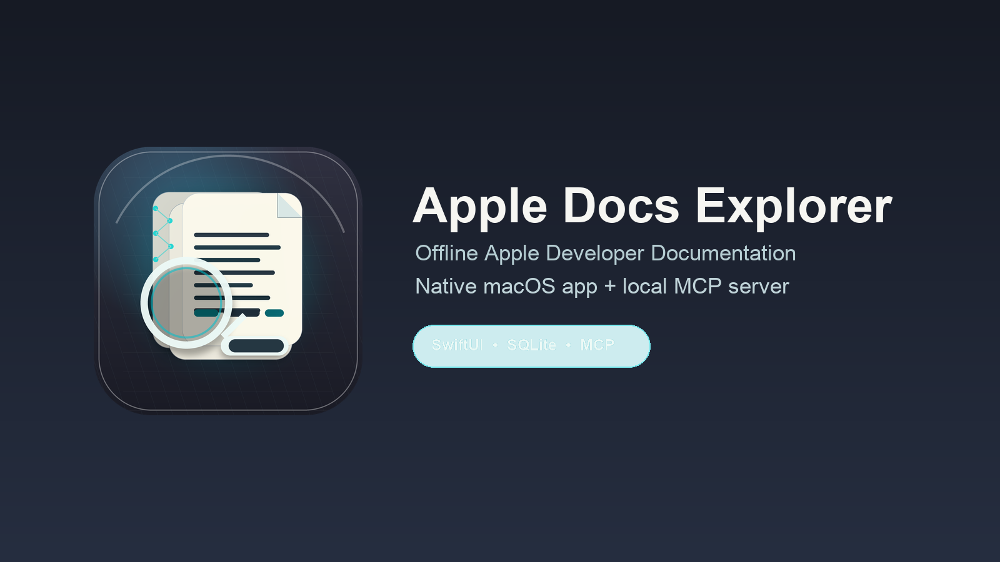
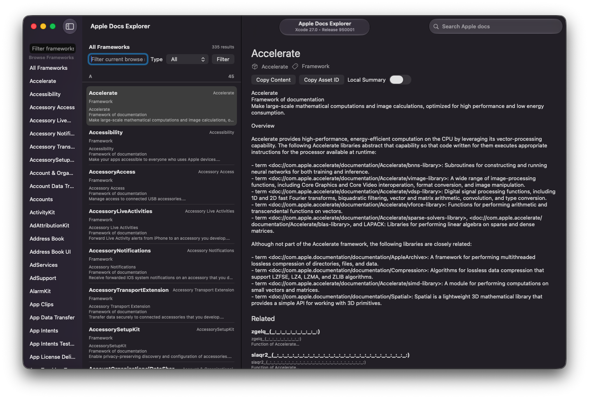

# Apple Docs Explorer

Apple Docs Explorer is a native macOS app for reading Apple's locally installed Developer Documentation asset from Xcode 27. It is offline-first, Apple-docs-only, and built for developers who want fast lookup without waiting on a web UI or spending AI-chat tokens on basic API documentation.

The app is the primary product. The repo also includes a small CLI and MCP server so Codex, Xcode, and other local agents can query the same local index before asking a model to reason about API usage.





## Why this exists

Apple already ships a local documentation corpus with Xcode, but the default lookup flow is not always optimized for fast, repeated engineering work. Developers often need to jump between frameworks, symbols, snippets, and related topics while staying in their editor. AI coding agents have the same problem: they should not spend tokens rediscovering basic API docs that already exist on disk.

Apple Docs Explorer gives both humans and local agents a shared, offline source of truth:

- Browse a specific kit such as CloudKit, ActivityKit, Accessory Notifications, StoreKit, or SwiftUI.
- Search symbols and topics across the installed docs asset.
- Inspect readable excerpts and raw entry metadata.
- Copy content or stable asset IDs for notes, PRs, and agent follow-up.
- Let MCP-aware tools fetch compact structured docs first, then request full content only when needed.

## Status

This is an early public v0.1 project. It targets the Xcode 27 Apple Developer Documentation asset format and may need adapter updates when Apple changes the local schema.

Current scope:

- Native macOS SwiftUI app.
- Offline Apple documentation browsing and search.
- Read-only access to Apple's installed SQLite asset.
- CLI diagnostics and browse/search checks.
- Optional stdio MCP server.
- Docker image for CLI/MCP usage.

Not in v0.1:

- Cloud sync, accounts, or hosted backend.
- Re-ingesting Apple's full documentation corpus into a custom database.
- Non-Apple documentation sources.
- Linux GUI support. Docker is CLI/MCP only.

## Features

- **Native app identity:** includes a generated macOS app icon and public project image for releases, README previews, and community sharing.
- **Search-first lookup:** search framework names, symbols, doc types, and content.
- **Browse-first exploration:** browse all frameworks, filter by kit name, and drill into a specific framework.
- **Grouped framework pages:** framework overview, topics, articles, tutorials, samples, symbols, and other entries.
- **Framework-name normalization:** display names like `Accessory Notifications` resolve to asset identifiers like `AccessoryNotifications`.
- **Native macOS UI:** split-view layout, searchable toolbar, copy actions, dark/light mode support.
- **Local summaries on demand:** summaries are optional and local; raw docs remain the default.
- **Agent-friendly MCP:** compact structured results with stable `asset_id` values for follow-up fetches.

## Requirements

- macOS 15 or newer.
- Swift 6.2 or newer.
- Xcode 27 with local Apple Developer Documentation installed.
- XcodeGen if you want to regenerate the `.xcodeproj`.
- Docker Desktop if you want to build or run the CLI/MCP container.

The app expects the docs asset at:

```text
/System/Library/AssetsV2/com_apple_MobileAsset_AppleDeveloperDocumentation
```

For alternate paths or Docker mounts, set:

```bash
export APPLE_DOCS_ASSET_ROOT=/path/to/com_apple_MobileAsset_AppleDeveloperDocumentation
```

## Quick Start

Clone and test:

```bash
git clone https://github.com/LarryAlexander/apple-docs-explorer.git
cd apple-docs-explorer
swift test
swift run DocsCLI diagnose-asset
```

Generate the Xcode project:

```bash
./scripts/generate_project.sh
```

Launch the macOS app:

```bash
./scripts/launch_app.sh
```

Useful CLI checks:

```bash
swift run DocsCLI list-frameworks cloudkit
swift run DocsCLI browse-framework "Accessory Notifications"
swift run DocsCLI search "CKRecord"
```

## MCP Server

Run the stdio MCP server:

```bash
./scripts/serve_mcp.sh
```

Example Codex MCP config:

```json
{
  "mcpServers": {
    "apple-docs-explorer": {
      "command": "/absolute/path/to/apple-docs-explorer/scripts/serve_mcp.sh"
    }
  }
}
```

Tools exposed:

- `search_apple_docs(query, framework?, limit?)`
- `get_doc_entry(asset_id)`
- `lookup_symbol(name, framework?)`
- `related_docs(asset_id, limit?)`

The MCP server returns compact structured results first. Agents can follow up with `get_doc_entry` only when they need full content.

## Docker

The Docker image packages the CLI and MCP binaries. It does not run the macOS GUI.

Build:

```bash
docker build -t apple-docs-explorer:local .
```

Run diagnostics with the local docs asset mounted read-only:

```bash
docker run --rm \
  -e APPLE_DOCS_ASSET_ROOT=/docs-asset \
  -v /System/Library/AssetsV2/com_apple_MobileAsset_AppleDeveloperDocumentation:/docs-asset:ro \
  apple-docs-explorer:local diagnose-asset
```

Run a search:

```bash
docker run --rm \
  -e APPLE_DOCS_ASSET_ROOT=/docs-asset \
  -v /System/Library/AssetsV2/com_apple_MobileAsset_AppleDeveloperDocumentation:/docs-asset:ro \
  apple-docs-explorer:local search CloudKit
```

Use the MCP binary inside the image:

```bash
docker run --rm -i \
  -e APPLE_DOCS_ASSET_ROOT=/docs-asset \
  -v /System/Library/AssetsV2/com_apple_MobileAsset_AppleDeveloperDocumentation:/docs-asset:ro \
  --entrypoint apple-docs-mcp \
  apple-docs-explorer:local
```

See [docs/RELEASE.md](docs/RELEASE.md) for release tagging and GHCR publishing notes.

## Architecture

The project intentionally keeps Apple's on-disk schema behind a small adapter boundary:

- `DocsAssetLocator`: finds and validates the active Apple docs asset.
- `DocsStore`: read-only SQLite access over Apple's installed asset.
- `SearchEngine`: ranking, filtering, snippets, framework browsing, and related docs.
- `AppleDocsExplorer`: SwiftUI macOS shell.
- `DocsCLI`: diagnostics and local verification.
- `DocsMCP`: thin MCP adapter over `SearchEngine`.

Read more in [docs/ARCHITECTURE.md](docs/ARCHITECTURE.md).

## Contributing

Contributions are welcome. This is a good project for macOS, SwiftUI, local search, SQLite, and MCP improvements.

Start with:

```bash
swift test
swift run DocsCLI diagnose-asset
swift run DocsCLI browse-framework "Accessory Notifications"
```

Then read [CONTRIBUTING.md](CONTRIBUTING.md).

## License

MIT. See [LICENSE](LICENSE).

This project does not redistribute Apple's documentation corpus. It reads the locally installed asset already present on the user's Mac.
